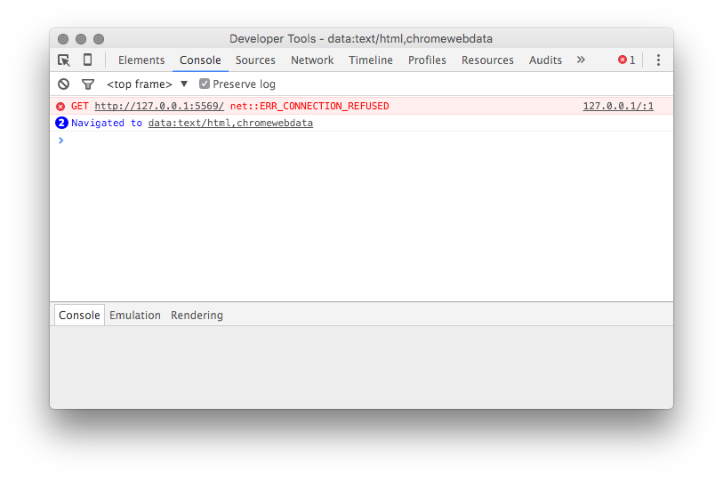

## Introduction

Debugging Shiny applications can be challenging. Because Shiny is reactive, code execution isn't as linear as you might be used to, and your application code runs behind a web server and the Shiny framework itself, which can make it harder to access. 

The goal of this article is to arm you with tools and techniques for debugging in Shiny specifically. If you're interested in tools for debugging R more generally, we recommend reading [Debugging with RStudio](https://support.rstudio.com/hc/en-us/articles/205612627-Debugging-with-RStudio) instead. The [Debugging and Exceptions](http://adv-r.had.co.nz/Exceptions-Debugging.html) chapter in Hadley Wickham's excellent book [Advanced R](http://adv-r.had.co.nz/) is also extremely helpful if you're new to debugging in R. 

We'll cover three main approaches:

1. **Debugging**

    Pausing execution of your program, at a place you choose, to inspect its state as each following statement is executed. Best used when you suspect where a problem lies or need to verify the state around a particular section of code.

2. **Tracing**
  
    Collecting information as your program runs, without pausing it, for later analysis. Best used when you're diagnosing systemic issues (for instance, reactivity), when you can't debug, or when frequent interruption is inappropriate.

2. **Error handling**

    Finding the source of errors (both on the client and server side) and ascertaining their cause. 

## Debugging

### Breakpoints

If you know, or suspect you know, where in the code the problem lies, the most straightforward debugging technique is setting a breakpoint. In RStudio, you can do this just by clicking to the left of the line number.


When you run your Shiny app, R will stop execution at the breakpoint, and you can begin stepping through your code.


While stepping, you can examine the contents of the environment and the callstack to see how execution reached your code, and what values it's working with.

Currently, setting breakpoints inside Shiny applications is only possible in the RStudio IDE because no other R front end implements the Shiny debugging interface; the traditional R breakpoint utilities such as [`setBreakpoint`](https://stat.ethz.ch/R-manual/R-devel/library/utils/html/findLineNum.html) don't work with Shiny.

#### Breakpoint Limitations

Unfortunately, breakpoints aren't helpful in all situations. For technical reasons[^1], breakpoints can *only* be used inside the `shinyServer` function. You can't use them in code in other .R files. And breakpoints can tell you something about why code is executing, but they can't always tell you why something *isn't* executing. 

### browser() statements

The `browser()` statement is another useful debugging tool. It acts like a breakpoint--when evaluated, it halts execution and enters the debugger. You can add it anywhere an R expression is valid. 


Unlike breakpoints, `browser()` works everywhere, so it's suitable for use in any code invoked by your Shiny app. You can also invoke `browser()` conditionally to create conditional breakpoints; for instance:

```{r eval=FALSE}
if (input$bins > 50)
  browser()
```

The downside of `browser()` is that you need to re-run your Shiny application to apply it, and you need to remember to take it out afterwards. 

## Tracing 

In many cases it's difficult to diagnose a problem by halting execution, and instead you need to observe the system as it runs. This is particularly true of Shiny applications since the system doesn't run once through linearly as an R script does! We'll look at a number of ways to peek into the system while it's running.

### Showcase Mode

If you've ever visited the [Shiny Gallery](http://shiny.rstudio.com/gallery/), you've probably seen Showcase Mode. In Showcase Mode, your code is shown alongside your application, and your application's server code flashes yellow when it executes. Here, for example, you can see the plot output chunk re-executing when the inputs change.


Showcase Mode is useful for visualizing which parts of your code are executing as a user interacts with your application.  It is not enabled by default for privacy reasons (most people don't want it to be easy for others to see their app's code!), but it's easy to turn on. Just invoke runApp directly with `display.mode="showcase"`: 

    > shiny::runApp(display.mode="showcase")

If you want showcase mode to be on by default (for an extended debugging session, or if you want to use showcase mode in conjunction with the IDE Run App button), add a file named `DESCRIPTION` to your app's folder, with these contents:

    Title: My App
    Author: Alice Smith
    DisplayMode: Showcase
    Type: Shiny
    
### The Reactive Log

Another way to trace the execution of reactives at runtime is to use the Shiny reactive log. In addition to telling you which reactives are executing, the reactive log will help you visualize the dependencies between reactive objects, and give you very detailed information about what's happening under the hood as Shiny evaluates your application.

Start a new R session and run the command:

    > options(shiny.reactlog=TRUE) 
  
Then, launch your Shiny app. In the Shiny app, press *Ctrl+F3* to launch the reactive log visualization. It'll look something like this:


The reactive log has many features and controls and we won't belabor them here; for more information, type `?shiny::showReactLog` at the R console, or read the [`showReactLog` online documentation](http://shiny.rstudio.com/reference/shiny/latest/showReactLog.html).

### "printf" tracing

In some situations the best tracing technique is the oldest: a statement that emits text to the console when it's reached. These are more work to use, but offer the unique advantage of allowing you to emit the values of variables without interrupting execution. 

You can do this by using the `cat` command in your Shiny application to print to standard error (`stderr()`). For instance, from the sample Shiny application:

```{r eval = FALSE}
# generate bins based on input$bins from ui.R
x    <- faithful[, 2] 
bins <- seq(min(x), max(x), length.out = input$bins + 1)
cat(file=stderr(), "drawing histogram with", input$bins, "bins\n")
```
    
After adding your `cat` statement, run your Shiny application and watch the R console. You'll see a line emitted each time the code runs. 

    Listening on http://127.0.0.1:5757
    drawing histogram with 30 bins
    drawing histogram with 35 bins
    
A note about `stderr()`: in most cases `cat("my output")` (i.e. printing to standard out) will work correctly, but in others (e.g. inside a `renderPrint`, which uses [`capture.output`](https://stat.ethz.ch/R-manual/R-devel/library/utils/html/capture.output.html) to redirect output), it won't, so we recommend always sending trace output to `stderr()`. 

#### Tracing on Shinyapps.io

`cat()` is also one of the few tracing techniques which works well even on a remote system. If your application is deployed on RStudio's [ShinyApps.io service](https://www.shinyapps.io/), then you can see the output the `cat()` traces in your deployed app, in real time. Here's how:

1. Add `cat(file=stderr(), ...)` tracing statements to your application.
2. Deploy your application, using the RStudio IDE or the `rsconnect::deployApp()` function. 
3. From the application's directory, run `rsconnect::showLogs(streaming = TRUE)`
4. Navigate to the application (on ShinyApps.io) in your browser, and watch the R console for output.

You'll see something like the  following:

    2016-01-29T01:26:12.291216+00:00 shinyapps[77594]: 
    2016-01-29T01:26:12.291218+00:00 shinyapps[77594]: Starting R with process ID: '26'
    2016-01-29T01:26:14.162374+00:00 shinyapps[77594]: drawing histogram with 30 bins
    2016-01-29T01:26:14.495249+00:00 shinyapps[77594]: drawing histogram with 35 bins

If your application gets a lot of usage, you may wish to guard the `cat()` output so that only your own sessions emit it, as it will be otherwise difficult to distinguish output from your own sessions with output from other sessions. 

#### Tracing on Shiny Server 

The `cat(file=stderr(), ...)` mechanism also works in Shiny Server. The trace output will be placed in a log under:

    /var/log/shiny-server/*.log
    
There's one log for each R process; you can `tail -f` the `log` file for any process to see output in real time. Because logs are deleted when the R process ends, you'll only be able to see logs while your application is open (so don't close your browser!). 

You can read more about Shiny Server's logging files/directories for individual Shiny apps in the [Logging and Analytics](https://rstudio.github.io/shiny-server/latest/#logging-and-analytics) section of the [Shiny Server Professional Administrator's Guide](https://rstudio.github.io/shiny-server/latest/).

#### cat() Caveats

One thing to keep in mind while using `cat()` to trace values at runtime is that Shiny doesn't give it special treatment--if your `cat()` expression references reactive values, a dependency will be created. This may cause your application to behave differently with the `cat()` statement than without it, which is obviously undesirable.

Make certain that any reactives referenced by the `cat()` statement are already referenced elsewhere in the observer or reactive in which it resides. 

### Client/Server Tracing

Shiny's architecture consists of a client (the browser) and a server (an R process). The two are connected by a [websocket](https://developer.mozilla.org/en-US/docs/Web/API/WebSockets_API) that receives state changes from the client, such as new values for input controls, and distributes state changes from the server, such as new output values. 

In some cases (for instance, if you're writing your own custom bindings) it's helpful to see exactly what's going across the wire. You can watch the JSON emitted to and received from the websocket by turning on tracing:

    > options(shiny.trace = TRUE)

Once tracing is on, you'll se a lot of output in the console while your app is running. Here's a sample:

    SEND {"config":{"workerId":"","sessionId":"04531d50d12554bd981b24b9d3983cc4"}}
    RECV {"method":"init","data":{"bins":30,".clientdata_output_distPlot_width":610,".clientdata_output_distPlot_height":400,".clientdata_output_distPlot_hidden":false,".clientdata_pixelratio":1,".clientdata_url_protocol":"http:",".clientdata_url_hostname":"127.0.0.1",".clientdata_url_port":"5569",".clientdata_url_pathname":"/",".clientdata_url_search":"",".clientdata_url_hash_initial":"",".clientdata_singletons":"",".clientdata_allowDataUriScheme":true}}

The log is from the perspective of the client, so:

`SEND` indicates data sent from the browser to the R session.

`RECV` indicates data sent from the R session to the browser.

Another way to dig into the data available to the R session is to look at the `session$clientData` object. You can read more in this article on the Shiny developer center:

[Learn about your user with session$clientData](http://shiny.rstudio.com/articles/client-data.html)

### What about trace()?

If you're a seasoned R programmer, you may have used the [`trace()`](https://stat.ethz.ch/R-manual/R-devel/library/base/html/trace.html) function to add tracing without modifying your script. Unfortunately, it's not possible to use this utility (or any that depend on it, such as `setBreakpoint`) with Shiny. `trace()` works by rewriting the body of the function to be traced, so the function must already exist when you run it. Shiny generates functions at runtime that aren't easily addressable.

## Errors

Some code defects will result in a runtime error. While no one likes to see errors, they can be an invaluable tool for helping you verify code preconditions at runtime. Often, throwing an error immediately when the system's state becomes invalid (known as the [fail-fast property](https://en.wikipedia.org/wiki/Fail-fast)) will save you debugging time, as an observed problem may be miles downstream from its source. 

Whether you're throwing your own errors or handling errors thrown elsewhere (for instance, by packages your Shiny application uses), here are some essentials for your toolkit.

### R errors

Most of the errors you'll be dealing with will be raised by R; here we'll describe strategies for dealing with these errors.

#### R error tracebacks

In earlier versions of Shiny, it could be difficult to locate errors; they the error itself would be printed at the console, but it was always necessary to do some work to see where the error originated.

Thankfully the latest version of Shiny (0.13.0 at time of writing) includes a feature which automatically dumps not only the error but a stack trace indicating where the error occurred to the console. 

Try, for example, introducing an error into the sample Shiny app.

```{r eval=FALSE}
bins <- seq(min(x), max(x), length.out = input$bins + 1)
if (input$bins > 40)
  stop("too many bins")
```

Now, run the app and drag the slider to the right to enter the error condition. The console will show you a stack trace:

    Warning: Error in renderPlot: too many bins
    Stack trace (innermost first):
        76: renderPlot [server.R#20]
        68: output$distPlot
         1: shiny::runApp
         
What are those numbers before the function names (`76`, `68`, and `1`)? They're the indices into the call stack, which in this case contains nearly 80 calls. Most of those calls, though, are Shiny internals, which are hidden to make the stack trace easier to read. In the vast majority of cases, these internals won't be relevant to your error.

If you do need to see the entire call stack, you can set:

```{r eval = FALSE}
options(shiny.fullstacktrace = TRUE)
```
    
As you might imagine, this prints a very verbose stack strace!

    Warning: Error in renderPlot: too many bins
    Stack trace (innermost first):
        79: h
        78: .handleSimpleError
        77: stop
        76: renderPlot [server.R#20]
        75: ..stacktraceon..
        74: func
        73: withVisible
        72: func
        71: <Anonymous>
        70: do.call
        69: ..stacktraceoff..
        68: output$distPlot
        67: ..stacktraceon..
        66: orig
        65: func
        64: withCallingHandlers
        63: captureStackTraces
        62: withCallingHandlers
        61: shinyCallingHandlers
        60: doTryCatch
        59: tryCatchOne
        58: tryCatchList
        57: doTryCatch
        56: tryCatchOne
        55: tryCatchList
        54: tryCatch
        53: observerFunc
        52: doTryCatch
        51: tryCatchOne
        50: tryCatchList
        49: tryCatch
        48: contextFunc
        47: env$runWith
        46: withReactiveDomain
        45: ctx$run
        44: run
        43: withCallingHandlers
        42: captureStackTraces
        41: withCallingHandlers
        40: shinyCallingHandlers
        39: doTryCatch
        38: tryCatchOne
        37: tryCatchList
        36: tryCatch
        35: flushCallback
        34: FUN
        33: lapply
        32: ctx$executeFlushCallbacks
        31: .getReactiveEnvironment()$flush
        30: flushReact
        29: withReactiveDomain
        28: messageHandler
        27: withCallingHandlers
        26: captureStackTraces
        25: withCallingHandlers
        24: withLogErrors
        23: handler
        22: doTryCatch
        21: tryCatchOne
        20: tryCatchList
        19: tryCatch
        18: try
        17: <Anonymous>
        16: eval
        15: evalq
        14: doTryCatch
        13: tryCatchOne
        12: tryCatchList
        11: doTryCatch
        10: tryCatchOne
         9: tryCatchList
         8: tryCatch
         7: run
         6: service
         5: serviceApp
         4: withCallingHandlers
         3: captureStackTraces
         2: ..stacktraceoff..
         1: runApp
     
The `..stacktraceon..` and `..stacktraceoff..` calls indicate where Shiny would ordinarily have collapsed the stack.

#### Pausing on errors

Sometimes, knowing *where* an error occurred gives you enough information to fix it. At other times, though, you'll need additional context: What were the arguments to functions in the callstack? What were the values of local variables at the time the error occured? And so on.

You can cause Shiny to enter the debugger when an error occurs by using the following statement:

```{r eval = FALSE}
options(shiny.error = browser)
```
    
When an error occurs, Shiny will run the function you name (here it's our old frind `browser()`) and wait for it to return before handling the error. This gives you an opportunity to inspect the state of the system at the exact moment the error arose.


Now you can see, for example, the value of `bins` and `x` at the time the error occurred. There are some subtleties associated with error debugging, however:

##### Selecting a stack frame

Sometimes, the debugger won't put you in the frame you expect. If this happens, use the Traceback pane in RStudio and click on the frame you're interested in to see the code and values in that frame.

Note, however, that clicking on a frame won't actually change the environment in which expressions entered at the R console are evaluated. If you want to actually browse the environment of a stack frame interactively, use `recover()` to select a frame. 

##### Continuing after an error

The `shiny.error` function is invoked when an error occurs, but once the error has occurred, it's too late to suppress it! You're debugging, but there's no next expression to step to; after you're finished inspecting the error, continue in the debugger (type `c` or press Continue in RStudio) to let Shiny handle the error as it normally would.

### JavaScript errors

Occasionally, a runtime problem will be caused by an error occurring in JavaScript. This is most common when working with custom bindings and third-party JavaScript components.

Most web browsers contain a JavaScript console that can be used to view logs and unhandled exceptions. We'll focus here on Chrome since it's widely used on all three major desktop platforms, but the other major browsers are structured very similarly. 

To reach the JavaScript console in Chrome, do one of the following:

1. Click on the "hamburger menu" in the upper right corner of the browser
2. Navigate to *More Tools -> Developer Tools.*

Or, right click on the Shiny app and choose Inspect.

Once you have the developer tools open, click the Console tab. Here you'll see any unhandled JavaScript exceptions; for instance, here's an error raised when trying to load a Shiny app that's no longer running:



Leaving the development tools open is also a good idea when looking for JavaScript issues; in most browsers, merely having the developer tools open is enough to cause the browser enter the debugger automatically when an unhandled exception occurs.

#### First-chance exceptions

The JavaScript console doesn't tell you about *all* the JavaScript exceptions that were thrown, only those that were never caught. Sometimes, however, an exception that's swallowed by an exception handler contains crucial information. 

A little-known feature in most JavaScript debuggers will allow you to see exceptions when they're *thrown* (regardless of whether they're caught later). These are sometimes called "first chance" exceptions. You can break on them in Chrome by clicking the stop button labeled with pause (representing break on exception) and then checking the box "Pause on Caught Exceptions".


If the thrown/caught terminology is confusing to you, remember that the debugger typically pauses on *uncaught* (or unhandled) exceptions; you're asking it to pause on *caught* (handled) exceptions too.

There are great reference materials online available for most browser debugging tools (here's [one for Chrome](https://developer.chrome.com/devtools/docs/javascript-debugging)).

#### RStudio Desktop 

On Windows and Linux, there's a JavaScript console and debugger built into RStudio (many components of RStudio, including the window that displays Shiny applications, is built on an embedded copy of [QtWebKit](https://doc.qt.io/qt-5/qtwebkit-index.html]). You can't access it through a menu, but you can by right-clicking on your Shiny application and choosing *Inspect*.
 
On OS X, RStudio uses your system's version of Safari to show Shiny applications. By default, Safari's JavaScript debugging tools are turned off inside RStudio, but you can turn them on using this command in Terminal: 

    defaults write org.rstudio.RStudio WebKitDeveloperExtras -bool true
    
Restart RStudio, start your Shiny app, right-click on it, and you'll see a new *Inspect Element* option. Click it to launch the Safari JavaScript debugger.


 
## Asking for Help

Some bugs won't yield to even the most determined attempts at analysis, and you'll need to enlist the help of a second set of eyes. Fortunately there are several active forums where you can ask questions. Two we recommend are ['shiny' at StackOverflow](http://stackoverflow.com/questions/tagged/shiny) and [the shiny-discuss Google group](https://groups.google.com/forum/#!forum/shiny-discuss).

When asking for help, try to eliminate all the parts of your application that aren't related to the problem, so that anyone volunteering to help can understand the issue quickly. You'll often find that the process of isolating the problem and formulating a description leads you to the answer before you can post the question!

The article [How to get help](http://shiny.rstudio.com/articles/help.html) on the Shiny Developer Center describes in detail what you'll want to include when asking for help.

[^1]: Breakpoints work by modifying a function body at runtime to include a `browser()` statement. The functions in Shiny applications are ephemeral--they are created on demand when the app starts, and exist only why it's running. 
