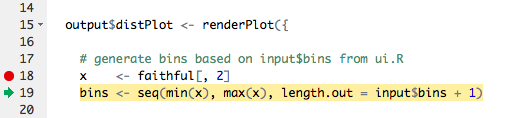
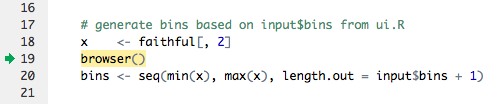
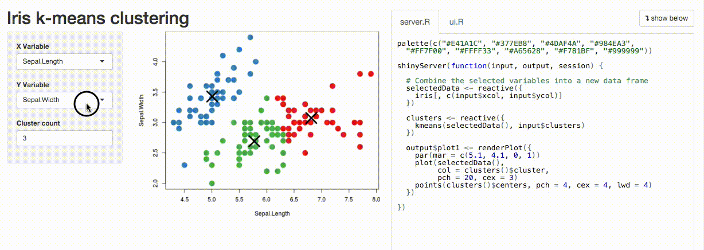
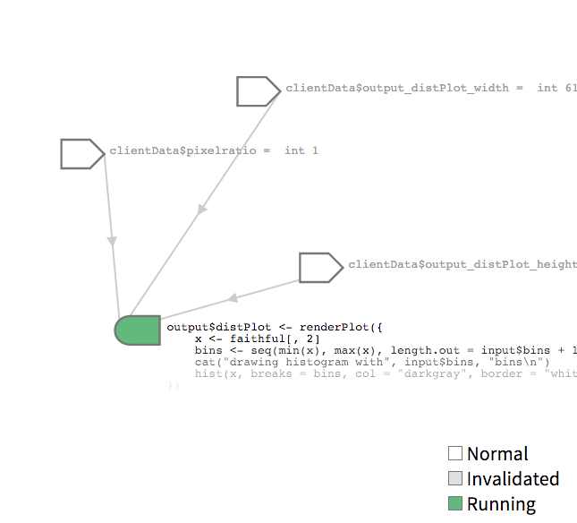
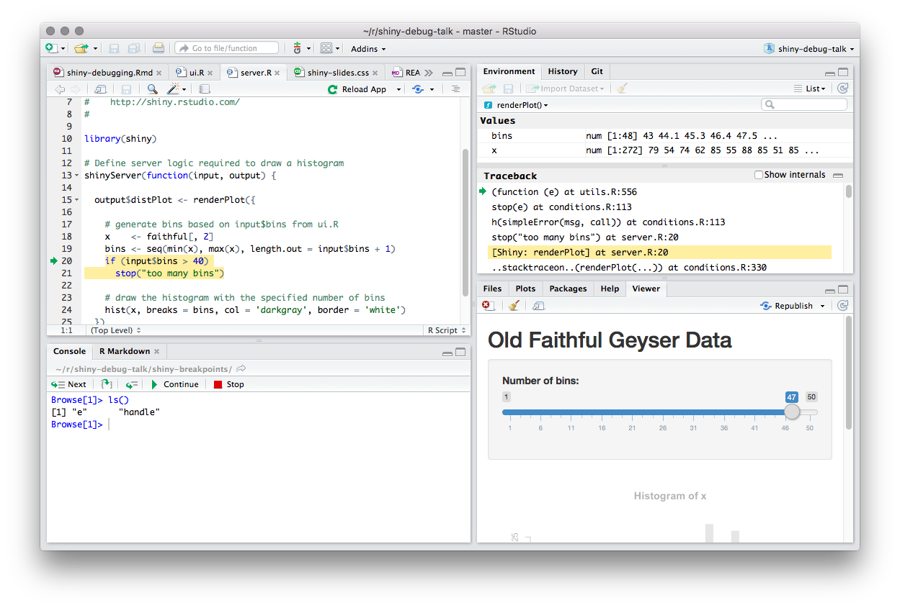
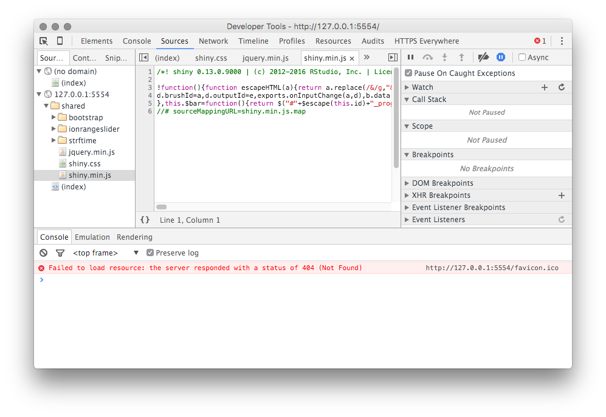
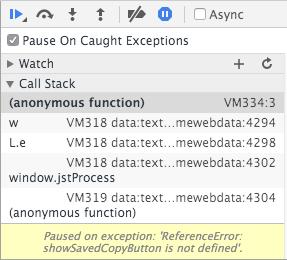
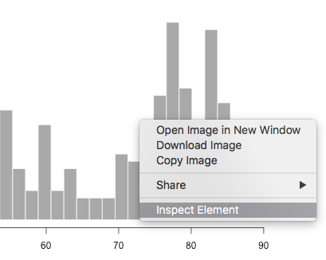

# Overview

## Goals 

### You will learn:

- Tools for finding bugs & diagnosing errors in Shiny applications
- Little-known ways to look under the covers 
- How to debug problems in deployed apps
- Cheat code for IDE JavaScript debug tools

## Outline

### We'll cover three main areas:

- Debugging
- Tracing 
- Errors

# Debugging

"Finding your bug is a process of confirming the many things that you believe are true — until you find one which is not true."

-- Norm Matloff 

Author of *The Art of R Programming* and *The Art of Debugging*

## Breakpoints


*Breakpoint (armed)*

## Breakpoints



*Stepping after execution*

## Breakpoints {.build}

### Pros

- Doesn't change code
- Can inspect local values/stack
- Can step through following code

### Cons

- Only works inside `shinyServer`
- Can't tell you why something isn't happening
- Interrupts program flow; not conditional

## browser()



## Conditional breakpoint

```{r eval=FALSE}
if (input$bins > 50)
  browser()
```

## browser() {.build}

### Pros

- Similar advantages to breakpoints
- Valid anywhere an R expression is valid
- Can be made conditional

### Cons
 
- Changes your code!
- Interrupts program flow
- Can't tell you why something isn't happening

# Tracing

<div class="notes">
In many cases it's difficult to diagnose a problem by halting execution, and instead you need to observe the system as it runs. This is particularly true of Shiny applications since the system doesn't run once through linearly as an R script does! We'll look at a number of ways to peek into the system while it's running.
</div>

## Showcase Mode {.build}

```{r eval=FALSE}
runApp(..., display.mode="showcase")
```



## Showcase Mode {.build}

### Pros

- Very easy to use
- Helps find unnecessary or unexpected execution

### Cons

- Doesn't scale well to larger apps
- Won't show you *why* a reactive or observer executed

## Reactive Log {.build}

```{r eval=FALSE}
options(shiny.reactlog=TRUE)
runApp(...)
showReactLog()
```



## Reactive Log {.build}

### Pros

- *Can* show you why something isn't happening!
- No more thorough way of visualizing reactivity

### Cons

- Lots of data to sift through
- Not real-time

## "printf" tracing {.build}

```{r eval = FALSE}
# generate bins based on input$bins from ui.R
x    <- faithful[, 2] 
bins <- seq(min(x), max(x), length.out = input$bins + 1)
cat(file=stderr(), "drawing histogram with", input$bins, "bins\n")
```

    Listening on http://127.0.0.1:5757
    drawing histogram with 30 bins
    drawing histogram with 35 bins
    
## "printf" tracing {.build}

### Pros

- Actual values at runtime, w/o modifying flow
- Only method that works after deployment

### Cons

- Limited to textual representation of values
- Modifies code 
- Watch out for reactive side effects!

## Tracing on Shinyapps.io {.build}

```{r eval = FALSE}
rsconnect::deployApp( ... )
rsconnect::showLogs(streaming = TRUE)
```

    2016-01-29T01:26:12 shinyapps[77594]: 
    2016-01-29T01:26:12 shinyapps[77594]: Starting R with process ID: '26'
    2016-01-29T01:26:14 shinyapps[77594]: drawing histogram with 30 bins
    2016-01-29T01:26:14 shinyapps[77594]: drawing histogram with 35 bins
    
## Tracing in Shiny Server

    tail -f /var/log/shiny-server/myapp-20160131-104403-8492.log

Only while R session is alive!

## Client/server tracing {.build}

```{r eval = FALSE}
options(shiny.trace = TRUE)
```

    SEND {"config":{"workerId":"","sessionId":"04531d50d12554bd981b24b9d3983cc4"}}
    RECV {"method":"init","data":{"bins":30,".clientdata_output_distPlot_width":610,
          ".clientdata_output_distPlot_height":400,".clientdata_output_distPlot_hidden":false,
          ".clientdata_pixelratio":1,".clientdata_url_protocol":"http:",
          ".clientdata_url_hostname":"127.0.0.1",".clientdata_url_port":"5569",
          ".clientdata_url_pathname":"/",".clientdata_url_search":"",
          ".clientdata_url_hash_initial":"",".clientdata_singletons":"",
          ".clientdata_allowDataUriScheme":true}}

# Error Handling

## Tracebacks {.build}

```{r eval=FALSE}
bins <- seq(min(x), max(x), length.out = input$bins + 1)
if (input$bins > 40)
  stop("too many bins")
```

    Warning: Error in renderPlot: too many bins
    Stack trace (innermost first):
        76: renderPlot [server.R#20]
        68: output$distPlot
         1: shiny::runApp
         
         
## Full tracebacks {.build}

```{r eval=FALSE}
options(shiny.fullstacktrace = TRUE)
```

    Warning: Error in renderPlot: too many bins
    Stack trace (innermost first):
        79: h
        78: .handleSimpleError
        77: stop
        76: renderPlot [server.R#20]
        75: ..stacktraceon..
        74: func
        ...
        
## Pausing on errors {.build}

```{r eval = FALSE}
options(shiny.error = browser)
```



## JavaScript errors: Browser {.build}

Right-click, inspect element, Console.



## JavaScript exceptions: first-chance



## JavaScript dev mode on OS X {.build}

    defaults write org.rstudio.RStudio WebKitDeveloperExtras -bool true
    


# Wrapup

Any questions?
